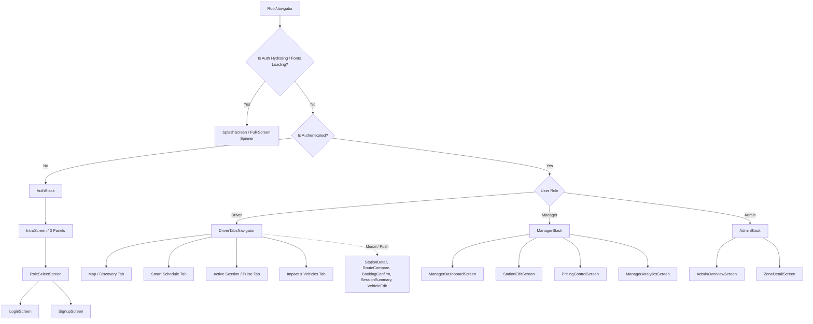

# M1-C1 Design Note: Expo Bootstrap, Navigation & HTTP Layer

**Owner:** Member 1 (Deep Pathak)  
**Branch:** `frontend/deep` (or `m1/c1-bootstrap`)  
**Target:** Android via Expo Go (Managed Workflow)  

---

## 1. Folder Structure (`app/src`)

The application architecture follows the modular domain-driven layout defined in the monorepo specification:

```
app/
├── assets/                  # App icons, splash, static graphics
├── src/
│   ├── api/                 # Networking, fetch client, mock routing, endpoint hooks
│   │   ├── client.ts        # Typed API method definitions
│   │   ├── config.ts        # Base URL, USE_MOCKS configuration loader
│   │   ├── http.ts          # Core fetch wrapper, JWT injection, 401 auto-refresh, mock dispatcher
│   │   └── mocks/           # Mock registry mapping endpoints to /contracts/examples/*.json
│   ├── components/          # Reusable UI kit & Living Grid primitives
│   │   ├── feedback/        # Skeleton, LinearProgress, Spinner, ChargingPulse, OfflineBanner
│   │   ├── layout/          # Screen container, Card, Sheet
│   │   ├── primitives/      # Text, Button, Input, Chip, SegmentedControl, ListRow
│   │   └── states/          # EmptyState, ErrorState
│   ├── features/            # Domain-scoped state and business logic
│   │   ├── auth/            # Auth store (zustand), session token management, credentials validation
│   │   ├── booking/         # Slot reservation, price lock management
│   │   ├── impact/          # Lifetime savings and CO₂ avoided calculation
│   │   ├── stations/        # Station discovery, filtering, greenness evaluation
│   │   └── vehicles/        # Vehicle profile state (battery, connector, efficiency)
│   ├── lib/                 # Utility functions & formatters
│   │   ├── formatters.ts    # Currency (₹ INR), Energy (kWh), Distance (km), Date/Time (IST)
│   │   ├── geo.ts           # Location helpers & polyline decoders
│   │   └── greenness.ts     # Greenness color scale (6 stops) & band mapping
│   ├── navigation/          # Navigation container, stacks, tab navigators, route guards
│   │   ├── types.ts         # NavigationParamList types for all stacks and screens
│   │   ├── RootNavigator.tsx# Auth-gated router (Splash / Auth / Driver / Manager / Admin)
│   │   ├── AuthStack.tsx    # Onboarding & authentication stack
│   │   ├── DriverTabs.tsx   # Driver bottom tab navigator + modal stacks
│   │   ├── ManagerStack.tsx # Station manager dashboard & controls
│   │   └── AdminStack.tsx   # Grid operator oversight screens
│   ├── screens/             # Screen components grouped by role
│   │   ├── auth/            # SplashScreen, IntroScreen, RoleSelectScreen, LoginScreen, SignupScreen
│   │   ├── driver/          # HomeMapScreen, StationDetailScreen, RouteCompareScreen, ActiveSessionScreen, etc.
│   │   ├── manager/         # ManagerDashboardScreen, StationEditScreen, PricingControlScreen, ManagerAnalyticsScreen
│   │   ├── admin/           # AdminOverviewScreen, ZoneDetailScreen
│   │   └── placeholder/     # Placeholder screens for initial bootstrap
│   └── theme/               # Living Grid design system tokens
│       ├── colors.ts        # Palette: Canvas, Surface, Brand (Green), Volt (Teal), Greenness Scale
│       ├── elevation.ts     # Restrained elevation tokens (e0, e1, e2)
│       ├── spacing.ts       # 4-base spacing & border radii
│       ├── tokens.ts        # Unified theme exports
│       └── typography.ts    # Space Grotesk & Manrope font mappings and type scale
├── app.config.ts            # Dynamic Expo config reading env variables
├── app.json                 # Static Expo metadata (Android package, permissions)
├── App.tsx                  # Root entry point: Font loading, React Query provider, NavigationContainer
├── package.json
├── tsconfig.json
└── .env.example
```

---

## 2. Navigation Graph

The navigation is structured around role-based routing gated by the `zustand` auth state (`isAuthenticated`, `role`, `isHydrating`):



### Route Definitions & Params:
- **`AuthStack`**: `Intro`, `RoleSelect`, `Login`, `Signup`, `VerifyOtp`
- **`DriverTabs`**:
  - `ExploreTab` (Home map, pin discovery, quick filters)
  - `SmartChargeTab` (Recommended renewable windows, schedule optimizer)
  - `ActivityTab` (Live charging pulse, active session progress)
  - `ProfileTab` (Vehicle profiles, lifetime ₹ saved, CO₂ avoided)
  - *Shared Driver Modals*: `StationDetail` (`{ stationId: string }`), `RouteCompare` (`{ stationId: string, origin: GeoPoint }`), `BookingConfirm` (`{ quote: PriceQuote }`), `SessionSummary` (`{ sessionId: string }`)
- **`ManagerStack`**: `ManagerDashboard`, `StationList`, `StationForm` (`{ stationId?: string }`), `PricingControls` (`{ stationId: string }`), `LiveSessions`, `StationAnalytics`
- **`AdminStack`**: `AdminOverview`, `ZoneDetail` (`{ zoneId: string }`), `NetworkAnalytics`

---

## 3. Libraries & Justification

| Package | Purpose & Justification |
|---|---|
| `expo` (Pinned SDK 52+) | Managed Expo runtime ensuring cross-platform stability on Android Expo Go. |
| `@react-navigation/native`, `@react-navigation/native-stack`, `@react-navigation/bottom-tabs` | Standard declarative navigation hierarchy with native screen transitions. |
| `react-native-screens`, `react-native-safe-area-context` | Native optimization for memory efficiency and handling Android notches/system bars. |
| `react-native-maps` | Pinned map renderer compatible with Android Expo Go (avoiding `expo-maps` which requires a dev build). |
| `@tanstack/react-query` | Server state management, caching, background refetching for grid snapshots & station quotes. |
| `zustand` | Lightweight client state for session tokens, active vehicle selection, filter criteria, and offline indicators. |
| `expo-secure-store` | Secure encrypted storage on Android KeyStore for JWT access and refresh tokens. |
| `expo-location` | GPS coordinate retrieval for driver positioning with smooth permission-denied fallbacks. |
| `@expo-google-fonts/space-grotesk` | Display, heading, and data numeral typography (₹, %, kWh, tabular numbers). |
| `@expo-google-fonts/manrope` + `expo-font` | High-legibility body, labels, captions, and micro UI typography. |
| `react-native-svg` | Vector graphics engine for the custom radial `GreennessGauge`, sparklines, and custom pins. |
| `zod` | Runtime schema validation for forms and API integration contract checks. |
| `expo-constants` | Safe injection and access of environment configurations (`API_BASE_URL`, `USE_MOCKS`, `GOOGLE_MAPS_ANDROID_KEY`). |

---

## 4. `USE_MOCKS` & `API_BASE_URL` Flow

### Configuration Source:
1. `.env` defines `API_BASE_URL` (e.g. `http://10.0.2.2:4000` for Android emulator or LAN IP) and `USE_MOCKS=true`.
2. `app.config.ts` reads `process.env` and exposes them via `extra` in `Constants.expoConfig.extra`.
3. `src/api/config.ts` parses and exports `API_BASE_URL` and `USE_MOCKS` boolean.

### HTTP Client Workflow (`src/api/http.ts`):
```
Client Request (e.g. fetchStations(params))
       │
       ▼
   http.ts
       │
       ├───▶ If USE_MOCKS === true:
       │        ├── Look up endpoint route in Mock Registry (contracts/examples/*.json)
       │        ├── Add simulated network latency (150ms)
       │        └── Return structured JSON mock directly
       │
       └───▶ If USE_MOCKS === false:
                ├── Retrieve JWT from SecureStore (if authenticated)
                ├── Attach Authorization: Bearer <token>
                ├── Execute fetch(`${API_BASE_URL}${path}`)
                ├── If HTTP 401 Unauthorized:
                │      ├── Attempt POST /auth/refresh using stored refresh token
                │      ├── On refresh success: Update SecureStore and replay original request
                │      └── On refresh failure: Clear auth state, redirect to AuthStack
                └── Return parsed JSON response
```

### Mock Registry Mapping:
- `GET /grid/live` $\rightarrow$ `contracts/examples/grid_live.json`
- `GET /grid/forecast` $\rightarrow$ `contracts/examples/grid_forecast.json`
- `GET /stations` $\rightarrow$ `contracts/examples/stations.json`
- `GET /stations/:id` $\rightarrow$ `contracts/examples/station_detail.json`
- `GET /pricing/quote` $\rightarrow$ `contracts/examples/pricing_quote.json`
- `GET /recommendations` $\rightarrow$ `contracts/examples/recommend.json`
- `POST /smartcharge/plan` $\rightarrow$ `contracts/examples/smartcharge_plan.json`

This ensures that UI development across all 12 Member 1 chunks proceeds seamlessly without backend dependencies, while flipping a single variable `USE_MOCKS=false` immediately switches the entire app to live endpoints.

---

## 5. Acceptance Criteria for M1-C1

1. Note reviewed and approved.
2. Expo app initialized with TypeScript under `/app`.
3. Dependencies installed and properly configured.
4. `app.json` + `app.config.ts` configured with `com.ecovolt.finder` and map key.
5. Directory hierarchy created matching the repo architecture.
6. `http.ts` implemented with `USE_MOCKS` switch and secure token handling.
7. Root `App.tsx` loads custom fonts (`Space Grotesk`, `Manrope`), renders a placeholder screen with React Query & Navigation container.
8. `npx tsc --noEmit` passes with 0 errors.
