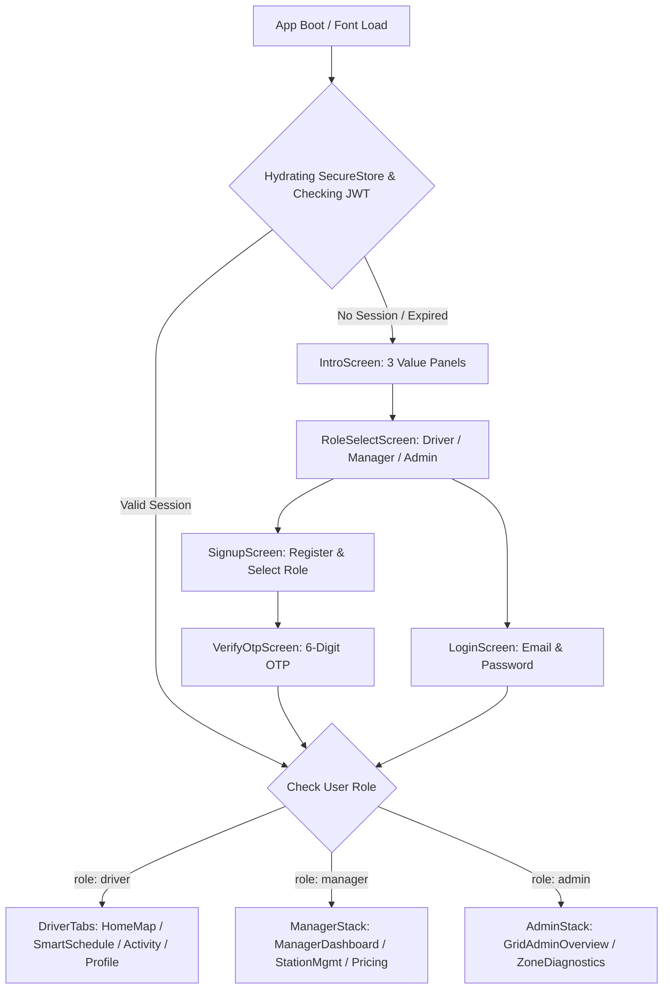

# M1-C3 Design Note: Auth Flow, Session Management & Role-Based Routing

**Owner:** Member 1 (Deep Pathak)  
**Branch:** `frontend/deep` (or `m1/c3-auth`)  
**Depends On:** M1-C2 (Living Grid Design System & UI Kit)  
**Consumes:** Node `/auth/*`, `/me` (via `/contracts/openapi.node.yaml` & `/contracts/examples/*.json`)  
**Status:** Awaiting User Review  

---

## 1. Screen Flow & User Journey



### Screen Details:
1. **`SplashScreen / Boot Spinner`**:
   - Full-screen `<Spinner size="large" />` centered on Canvas (`#F3F6F2`).
   - Hydrates tokens and user profile from SecureStore.
2. **`IntroScreen` (3 Value Panels Carousel)**:
   - *Panel 1 — See the Grid*: "Real-time renewable energy and carbon intensity for every charging hub across the region."
   - *Panel 2 — Cut Costs & CO₂*: "Save up to 40% on tariff costs and eliminate grid emissions by charging when solar and wind peak."
   - *Panel 3 — We Time It For You*: "Plug in anytime — smart schedule automatically charges your vehicle during the greenest hours."
   - Primary action: "Get Started" $\rightarrow$ `RoleSelectScreen`.
   - Secondary action: "Already have an account? Sign In" $\rightarrow$ `LoginScreen`.
3. **`RoleSelectScreen`**:
   - Interactive role selection cards (Driver, Station Manager, Grid Admin) with feature highlights.
   - Advances to `LoginScreen` or `SignupScreen` with the selected role prefilled.
4. **`LoginScreen`**:
   - Inputs: Email / Phone and Password.
   - Quick Demo Fill buttons for judging/review convenience (Driver, Manager, Admin).
   - Form validation powered by **Zod**.
   - `Button` in `busy` state with inline spinner ("Signing in…").
   - Actionable inline errors / `ErrorState` on invalid credentials.
5. **`SignupScreen`**:
   - Inputs: Full Name, Email, Password, Role selector, and EV class preference (4-Wheeler / 2-Wheeler).
   - Zod schema validation (email format, password min length, name required).
   - Advances to `VerifyOtpScreen`.
6. **`VerifyOtpScreen`**:
   - 6-digit numeric input with countdown resend timer.
   - Mock verification accepts any 6 digits (or default `123456`) when `USE_MOCKS=true`.

---

## 2. Auth Store & State Management (`features/auth/`)

The auth store is powered by `zustand` and synchronized with `expo-secure-store`.

### State Shape:
```ts
export type Role = 'driver' | 'manager' | 'admin';

export interface User {
  id: string;
  email: string;
  name: string;
  role: Role;
  phone?: string;
  createdAt?: string;
}

export interface AuthTokens {
  accessToken: string;
  refreshToken: string;
}

export interface AuthState {
  user: User | null;
  role: Role;
  isAuthenticated: boolean;
  isHydrating: boolean;
  error: string | null;

  // Actions
  hydrate: () => Promise<void>;
  login: (email: string, pass: string, role?: Role) => Promise<void>;
  signup: (name: string, email: string, pass: string, role: Role) => Promise<void>;
  verifyOtp: (email: string, otp: string) => Promise<void>;
  logout: () => Promise<void>;
  clearError: () => void;
  setRole: (role: Role) => void;
}
```

---

## 3. Storage, JWT Lifecycle & 401 Silent Refresh

1. **Storage via `expo-secure-store`**:
   - `ecovolt_access_token`: Short-lived Bearer JWT.
   - `ecovolt_refresh_token`: Long-lived Refresh token.
   - `ecovolt_user_data`: Cached serialized user profile.
2. **HTTP Layer Integration (`src/api/http.ts`)**:
   - Injects `Authorization: Bearer <accessToken>` into outgoing requests.
   - Intercepts `401 Unauthorized` responses $\rightarrow$ triggers single-flight `/auth/refresh` request using `refreshToken`.
   - On refresh success $\rightarrow$ updates tokens in SecureStore and retries original pending requests.
   - On refresh failure $\rightarrow$ clears SecureStore and resets auth store to bounce to `AuthStack`.
3. **Mock Mode (`USE_MOCKS=true`)**:
   - Resolves against `/contracts/examples/auth_login.json` and `/contracts/examples/me.json`.
   - Simulates token generation and storage so state persistence works identically across app restarts.

---

## 4. Zod Validation Schemas (`src/features/auth/validation.ts`)

```ts
import { z } from 'zod';

export const loginSchema = z.object({
  email: z.string().email('Please enter a valid email address'),
  password: z.string().min(6, 'Password must be at least 6 characters'),
});

export const signupSchema = z.object({
  name: z.string().min(2, 'Please enter your full name'),
  email: z.string().email('Please enter a valid email address'),
  password: z.string().min(6, 'Password must be at least 6 characters'),
  role: z.enum(['driver', 'manager', 'admin']),
  vehicleClass: z.enum(['car', 'bike']).optional(),
});

export const otpSchema = z.object({
  otp: z.string().length(6, 'Please enter the 6-digit verification code'),
});
```

---

## 5. Edge Cases & Closing Loopholes

| Edge Case | Solution & Voice |
|---|---|
| **Invalid Credentials** | Clear, specific inline field errors or `ErrorState`: *"Incorrect password for deep.driver@ecovolt.app · Check your password or use demo fill"*. |
| **Expired Access Token** | Invisible silent background refresh via `refreshToken`; user session never drops mid-action. |
| **Expired Refresh Token / Revoked Session** | Session cleanly reset, user navigated to Login with banner: *"Session expired · Please sign in to continue"*. |
| **Offline During Auth** | `OfflineBanner` shown with clear notification: *"Unable to reach auth server · Check your network connection"*. |
| **Role-Appropriate Landing** | Immediately mounts correct root stack: Driver $\rightarrow$ Map Tab, Manager $\rightarrow$ Operator Dashboard, Admin $\rightarrow$ Network Overview. |

---

## 6. Acceptance Criteria

1. Think-first note reviewed and approved.
2. `features/auth/` complete with Zod validation, zustand store, and SecureStore token persistence.
3. Screens created in `screens/auth/`: `IntroScreen`, `RoleSelectScreen`, `LoginScreen`, `SignupScreen`, `VerifyOtpScreen`.
4. `RootNavigator` seamlessly gates role navigation upon login/logout.
5. Session persists across app reload.
6. `npx tsc --noEmit` passes with 0 errors.
